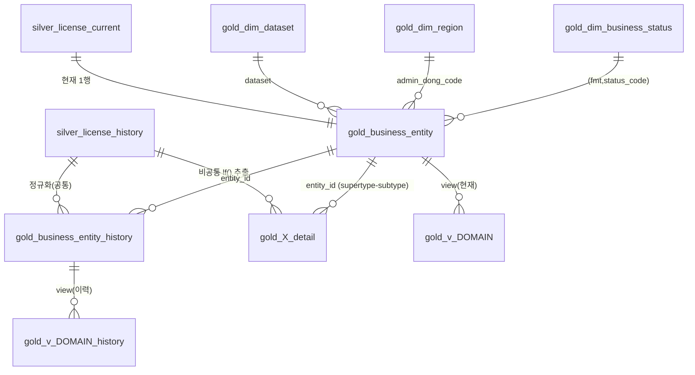

# docs/DB — commerce 테이블/뷰 명세 (레이어별)

commerce 도메인의 **모든 테이블·뷰와 그 관계**를 레이어별로 정리한 명세. 설계 근거(실측·클러스터링)는
[../silver-noncommon-catalogs.md](../silver-noncommon-catalogs.md), 기계가 읽는 카탈로그는
[../gold-catalog.csv](../gold-catalog.csv).

| 레이어 | 문서 | 내용 |
|---|---|---|
| silver | [silver/tables.md](silver/tables.md) | 공통 카탈로그(history/current) · 보강 참조 · marker |
| gold | [gold/tables.md](gold/tables.md) | Supertype(entity)+이력 · dim(code 정규화) · detail 78(cluster 8+single 70) · marker |
| gold | [gold/views.md](gold/views.md) | 도메인 view 8×2 · API view 152×2 (current/history) — 조회 인터페이스 |

## 전체 관계 (ERD)

- `gold_X_detail` = 78개 상세 테이블(카탈로그의 detail_cluster 8 + detail_single 70)의 대표 표기.
- 모든 detail 은 **entity_id(공통 supertype key)** 로만 공통과 연결 — 공통 컬럼 재저장 없음.
- 이력: silver history(append-only) → entity_history + detail(버전행). 조인 키
  `(entity_id, collected_at, content_hash)` — 같은 silver 버전행에서 나와 1:1 정합.

## 키 규약

| 키 | 정의 |
|---|---|
| `entity_id` | **결정적 서러게이트** = sha256(`dataset\|opnsfteamcode\|mgtno`) — 시퀀스 불필요, 재빌드 불변 |
| 버전 키 | `(entity_id, collected_at, content_hash)` — silver history 의 버전 그레인과 동일 |
| 증분 marker | `gold_load_run_marker.watermark_collected_at` — 완료 후에만 DONE, 중단 시 미완성 drop |
