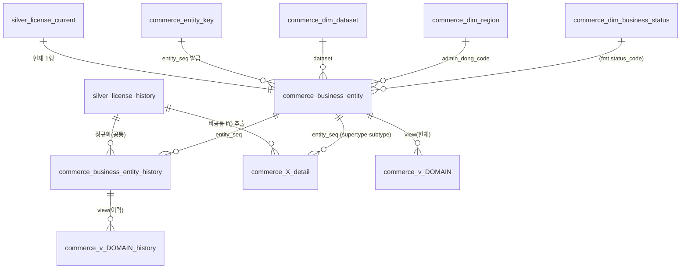

# docs/DB — commerce 테이블/뷰 명세 (레이어별)

commerce 도메인의 **모든 테이블·뷰와 그 관계**를 레이어별로 정리한 명세. 설계 근거(실측·클러스터링)는
[../silver-noncommon-catalogs.md](../silver-noncommon-catalogs.md), 기계가 읽는 카탈로그는
[../gold-catalog.csv](../gold-catalog.csv).

| 레이어 | 문서 | 내용 |
|---|---|---|
| silver | [silver/tables.md](silver/tables.md) | 공통 카탈로그(history/current) · 보강 참조 · marker |
| gold | [gold/tables.md](gold/tables.md) | Supertype(entity)+이력 · dim(code 정규화) · detail 78(cluster 8+single 70) · marker |
| gold | [gold/views.md](gold/views.md) | 도메인 view 8×2 · API view 152×2 (current/history) — 조회 인터페이스 |
| gold | [gold/cluster-domain-coherence.md](gold/cluster-domain-coherence.md) | detail cluster 8개 **도메인 정합성 검증**(공식 LOCALDATA 코드·소관 법령 대조 — 오병합 0건) |
| gold | [gold/normalization-plan.md](gold/normalization-plan.md) | **정규화(Option 1 적용됨)** — 저카디널리티 detail 컬럼 72쌍 실측검증 → `commerce_code_value` |
| gold | [gold/partitioning-indexing-plan.md](gold/partitioning-indexing-plan.md) | **인덱싱 적용됨 · 파티셔닝 보류** — view SQL 근거 6개 인덱스, 라이브 실측(1187ms→18ms) |

각 레이어 폴더는 자체 README 로도 진입한다: [silver/](silver/README.md) · [gold/](gold/README.md).
상위 문서 인덱스: [../README.md](../README.md).

## 전체 관계 (ERD)

- `commerce_X_detail` = 78개 상세 테이블(카탈로그의 detail_cluster 8 + detail_single 70)의 대표 표기.
- 모든 detail 은 **entity_seq(공통 supertype key)** 로만 공통과 연결 — 공통 컬럼 재저장 없음.
- 이력: silver history(append-only) → entity_history + detail(버전행). 조인 키
  `(entity_seq, collected_at, content_hash)` — 같은 silver 버전행에서 나와 1:1 정합.

## 키 규약

| 키 | 정의 |
|---|---|
| `entity_seq` | **bigint 서러게이트**(bigserial) — `commerce_entity_key(dataset,opnsfteamcode,mgtno)` 가 영구 발급. 2026-07-10 이전은 sha256 text 해시였으나 85테이블 조인/인덱스 비용 때문에 전환(근거: [gold/normalization-plan.md](gold/normalization-plan.md)) |
| 버전 키 | `(entity_seq, collected_at, content_hash)` — silver history 의 버전 그레인과 동일 |
| 증분 marker | `commerce_load_run_marker.watermark_collected_at` — 완료 후에만 DONE, 중단 시 미완성 drop |

## 명명·구동 규약

- **객체명에 레이어(gold) 금지** — 레이어는 DB/스키마가 식별. **`commerce_` 접두 = 도메인 식별**.
- **카탈로그도 DB 객체**: `commerce_catalog`(1행=객체 1개, catalog_version) — 카탈로그와 DB 동시 존재.
- **적재 DAG `commerce_load_gold`(2 task)**: `build_catalog`(실측→카탈로그 갱신+드리프트 리포트) →
  `load_gold`(**초기 DDL ensure: 없는 table/view 생성** → marker 증분 → 중단 방어 → DONE).
  상세: [gold/tables.md §6](gold/tables.md).
