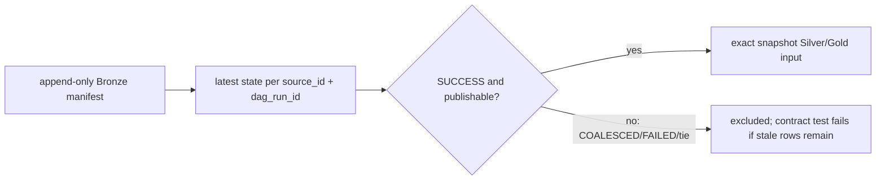

# Traffic·Weather COALESCED snapshot 최신 상태 계약 설계

## 목적

Asset event가 여러 개 누적될 때 ASAC-DAG는 선택되지 않은 Bronze run에 `COALESCED` 상태를 append한다. DBT는 manifest 이력을 먼저 `SUCCESS`로 필터링하면 과거 상태를 다시 소비할 수 있으므로, run별 **최신 상태를 먼저 확정한 뒤** publishable 여부를 판단해야 한다.

## 보존할 기존 의도

- Traffic transform과 recovery는 Airflow가 전달한 `traffic_snapshot_dag_run_id`만 소비한다. transform 도중 live 최신 run으로 다시 고정하지 않는다.
- Weather W2 bounded repair는 cutoff 시점 이전의 상태만으로 역사적 replay를 검증한다. cutoff 이후 상태 전이는 W2 repair의 입력을 소급 변경하지 않는다.
- Bronze manifest는 append-only audit trail이며, 기존 Bronze idempotency와 Silver incremental grain은 바꾸지 않는다.

## 선택한 구조

`macros/manifest_state.sql`에 `latest_manifest_run_state` macro를 둔다. 이 macro는 source/run별 manifest row를 `event_at DESC, dag_id DESC`로 정렬하고, 최신 상태 row 한 개만 반환한다. 동일한 최신 state key가 여러 개면 결과에서 제외한다. status 우선순위로 임의 tie-break하지 않는다.

각 소비 모델은 아래 두 단계로 분리한다.

1. macro 결과로 run의 최신 상태를 선택한다.
2. 그 결과에만 `manifest_status = 'SUCCESS' AND is_publishable`와 exact snapshot var 조건을 적용한다.

## 적용 범위

- Weather: scheduled compatibility Silver와 W1 observation Silver가 `weather_snapshot_dag_run_id`를 필수로 소비한다. Gold는 이 Silver 입력만 참조한다.
- Traffic: transform Silver/current, recovery Silver, current-state Gold의 exact manifest 확인과 legacy summary의 latest source 조회를 macro로 통일한다.
- Traffic Flow: `silver_seoul_traffic_flow`도 `traffic_flow_snapshot_dag_run_id`로 pin된 run의 최신 manifest 상태를 먼저 선택한다. Flow snapshot이 없는 실행의 기존 optional 동작은 유지하되, 최신 상태가 `COALESCED`이면 과거 `SUCCESS`를 소비하지 않는다.
- Traffic Flow Gold: `gold_traffic_incident_x_flow`는 incident를 driving relation으로 유지하며, flow match 여부와 무관하게 `silver_seoul_traffic_incident_current`와 동일한 incident cardinality를 보장한다.
- singular test는 raw `SUCCESS` history가 아니라 macro의 effective publishable state를 검증한다.
- Python contract test는 모든 정상 transform consumer가 macro를 사용하고 Weather var를 소비하는지 확인한다.

## 실패 처리

- 최신 상태가 `COALESCED` 또는 `FAILED`면 DBT input CTE가 해당 run을 반환하지 않는다.
- 최신 상태의 동일 key tie는 input에서 제외하며 contract test가 실패하도록 한다. 데이터가 임의 상태로 Gold에 반영되지 않는다.
- exact snapshot var가 없으면 dbt `var()`가 컴파일 오류를 내므로, Airflow invocation contract 위반은 조용히 fallback하지 않는다.

## 검증과 병합 순서

1. ASAC-DBT #210에서 Python contract test, `dbt deps`, `dbt parse`, target Docker compile/test를 통과시킨다.
2. DBT PR을 `dev`에 merge한다.
3. ASAC-DAG PR #372을 최신 `dev`와 함께 통합 검증한다.
4. 검증이 통과하면 #372을 ready 전환하고 merge한다. 두 PR이 merge되기 전에는 DAG asset schedule을 운영 경로에 반영하지 않는다.
