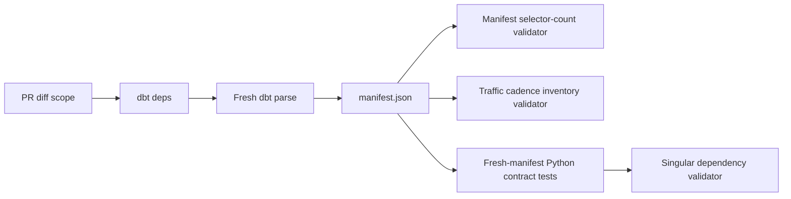

# Traffic·Weather pre-merge gate 최적화 설계

## 한 줄 목적

fresh dbt manifest를 정본으로 한 번만 생성하고, 같은 manifest에서 Traffic Gold cadence selector·inventory를 검증해 PR required gate의 중복 `dbt ls` 비용을 제거한다.

## 문제와 증거

2026-08-08 성공한 `validate-traffic-manifest` 실행(`31260158012`)은 총 약 7분이 걸렸다.

| 구간 | 실측 |
| --- | ---: |
| dependency 설치 | 약 10초 |
| `dbt deps` + full `dbt parse` | 약 11초 |
| selector 3회 계산과 inventory 검증 | 약 3분 57초 |
| Python test 346개 | 2분 34초 |

현재 `premerge_gate.py`는 full parse 뒤에 아래 selector를 각각 `dbt ls`로 다시 계산한다.

- `ask_seoul_traffic_transform_gold_gate_tests`
- `ask_seoul_traffic_transform_gold_hourly_tests`
- `ask_seoul_traffic_transform_gold_full_tests`

세 selector 모두 manifest의 test tag 조합만 다르게 선택하므로, 이미 생성한 manifest를 다시 dbt process 세 번으로 해석할 이유가 없다.

## 목표와 비목표

### 목표

- fresh manifest를 계속 생성한다. partial parse·이전 PR artifact 재사용으로 계약 검증을 약화하지 않는다.
- Traffic Gold gate/hourly/full selector count와 cadence inventory의 exact baseline을 계속 fail-closed로 검증한다.
- 현재 `validate-traffic-manifest` branch-protection check 이름을 유지한다.
- collection-state 운영 품질 test를 public Traffic Gold gate에서 분리한다.

### 비목표

- 이번 변경에서 prod 연결·적재·D1 Publisher·Worker API를 변경하지 않는다.
- 이번 변경에서 Airflow의 hot/hourly/daily runtime tier를 바꾸지 않는다. 이는 별도 후속 PR이다.
- Python test 병렬화나 GitHub Actions matrix는 이번 변경에 넣지 않는다.

## 설계

### 1. manifest-native selector count

`contracts/traffic/scripts/validate_traffic_gold_test_inventory.py`에 fresh manifest의 test node tag를 읽어 세 selector의 exact count를 계산하는 순수 함수를 둔다.

| selector | manifest-native 규칙 |
| --- | --- |
| gate | `ask_seoul_traffic_transform_gold` + `traffic_gold_gate` + test |
| hourly | gate union `traffic_gold_hourly_extension` tier test |
| full | hourly union `traffic_gold_daily_extension` tier test |

각 union은 `unique_id` set으로 계산해 dbt selector의 dedup 의미를 보존한다. 결과는 현재 hard-coded exact baseline 및 YAML inventory의 `selector_expected`와 비교한다. empty selector·count drift·tier 없는 Traffic Gold test는 기존과 같이 실패한다.

### 2. selector 정의 drift 방지

manifest-native 계산은 selector YAML을 임의로 해석하지 않는다. 대신 workflow test가 `selectors.yml`의 세 selector가 위 태그·resource_type 조건과 union 구조를 유지하는지 정적으로 검증한다. selector YAML을 변경하면 이 contract test를 갱신하지 않는 한 CI가 실패한다.

이 경계로 runtime selector semantics는 `selectors.yml`에, fast CI count 계산은 manifest validator에 명확히 분리된다.

### 3. collection-state test의 책임 분리

`gold_traffic_collection_slot_state`는 운영 품질 control-plane model이며 Traffic Core serving publication의 fast gate가 아니다.

- model column 설명은 유지한다.
- 상태 조합 검증은 singular test 하나로 유지한다.
- test path와 tag를 `traffic/collection_state`, `ask_seoul_collection_state`로 옮겨 125개 public Gold cadence inventory에서 제외한다.
- 해당 test는 dev 검증·후속 control-plane selector에서 명시 실행한다. public Traffic Gold 성공 marker와 D1 publication scope에는 영향을 주지 않는다.

## 실행 흐름

`dbt ls × 3`은 제거한다. manifest 생성 실패, tag/tier mismatch, inventory drift 또는 Python contract failure는 모두 required check를 실패시킨다.

## 검증 계획

1. 새 순수 selector-count 함수 unit test: gate/hourly/full의 union·dedup·wrong tag·empty tier를 검증한다.
2. selector YAML static contract test: 정의가 manifest-native 규칙과 동형인지 검증한다.
3. `python -m workflows.premerge_gate run`을 새 branch의 base/head로 실행해 CI와 같은 fresh manifest 흐름을 로컬에서 재현한다.
4. GitHub required check에서 count/inventory/Python tests가 성공하는지 확인한다.
5. 현재 workflow run과 비교해 selector/inventory 구간의 wall time을 기록한다. 기대치는 약 3분 57초 절감이지만 실제 수치만 보고한다.

## 롤백

문제가 생기면 이 변경 commit을 revert하면 기존 `dbt ls × 3` 실행 방식과 branch-protection check 이름으로 되돌아간다. 데이터·Iceberg table·R2·D1 상태에는 변경이 없다.
